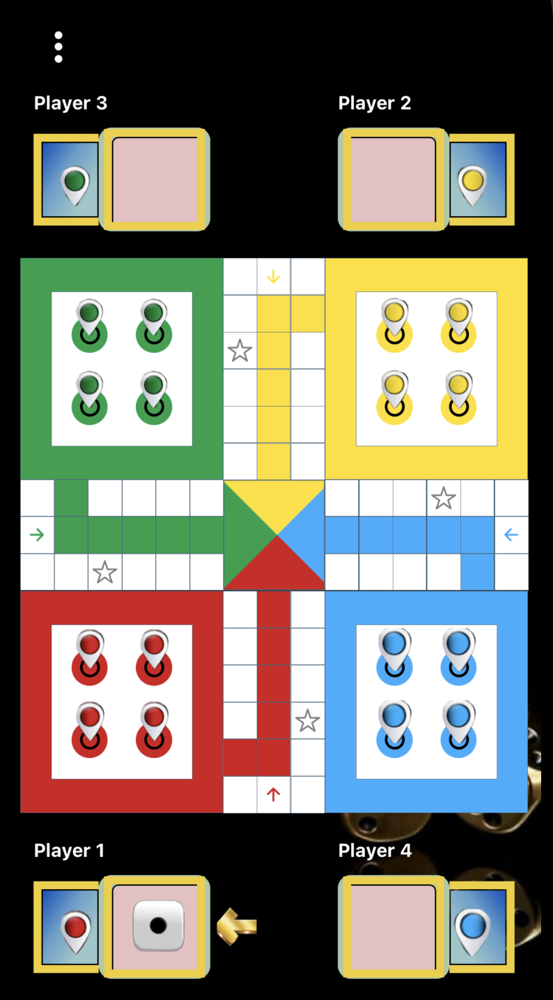

# Ludo Legend 🎲

A classic multiplayer board game built with React Native . Features turn-based gameplay, dice rolling mechanics, pawn movement, and winning logic. 


## ✨ Features

- 🎮 Support for 2-4 players
- 🎲 Realistic dice rolling with animations
- 🎯 Interactive game board with intuitive controls
- 🔊 Engaging sound effects
- 👥 Custom player names
- 🏆 Win detection and celebration animations
- 💾 Game state persistence
- 📱 Responsive design for various screen sizes
- 🏠 Safe spots and special cells mechanics
- 🔄 Turn-based gameplay with player indicators

## 🚀 Getting Started

### Prerequisites

- Node.js >= 20
- Ruby >= 2.7.6 (for iOS development)
- Xcode (for iOS development)
- Android Studio (for Android development)
- CocoaPods (for iOS development)

### Installation

1. Clone the repository:
```bash
git clone https://github.com/Janhvi21/ludo-legend.git
cd ludo-legend
```

2. Install dependencies:
```bash
# Install JavaScript dependencies
npm install

# Install iOS dependencies
cd ios
bundle install
bundle exec pod install
cd ..
```

### Running the Game

#### iOS
```bash
# Start the Metro bundler
npm start

# In a new terminal, run the iOS app
npm run ios
```

#### Android
```bash
# Start the Metro bundler
npm start

# In a new terminal, run the Android app
npm run android
```

## 🎮 How to Play

1. Launch the game and select the number of players (2-4)
2. Enter names for each player
3. Each player takes turns:
   - Roll the dice by tapping it
   - Select a token to move (if available moves exist)
   - Try to get all your tokens to the home triangle
4. First player to get all tokens home wins! 🏆

## 🛠 Tech Stack

- React Native 0.81.4
- React Navigation
- Redux Toolkit for state management
- React Native Paper for UI components
- Lottie for animations
- React Native SVG for vector graphics
- React Native Sound Player for audio
- AsyncStorage for persistence

## 🎨 Game Board Features

- Four unique colored zones (Red, Green, Blue, Yellow)
- Safe spots to protect your tokens
- Special cells with bonus moves
- Home triangles for each player
- Animated dice with random roll mechanics
- Token stacking in same cells
- Player names with turn indicators

